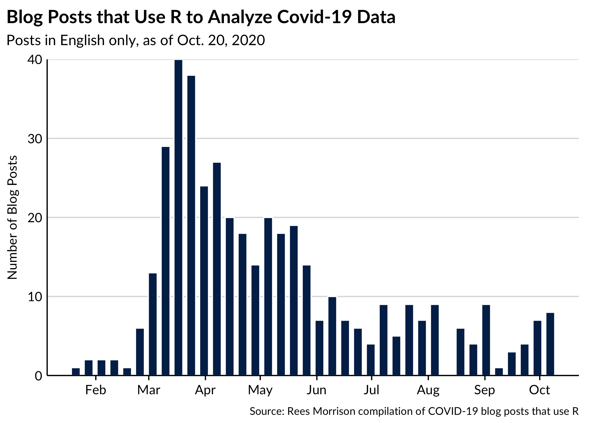
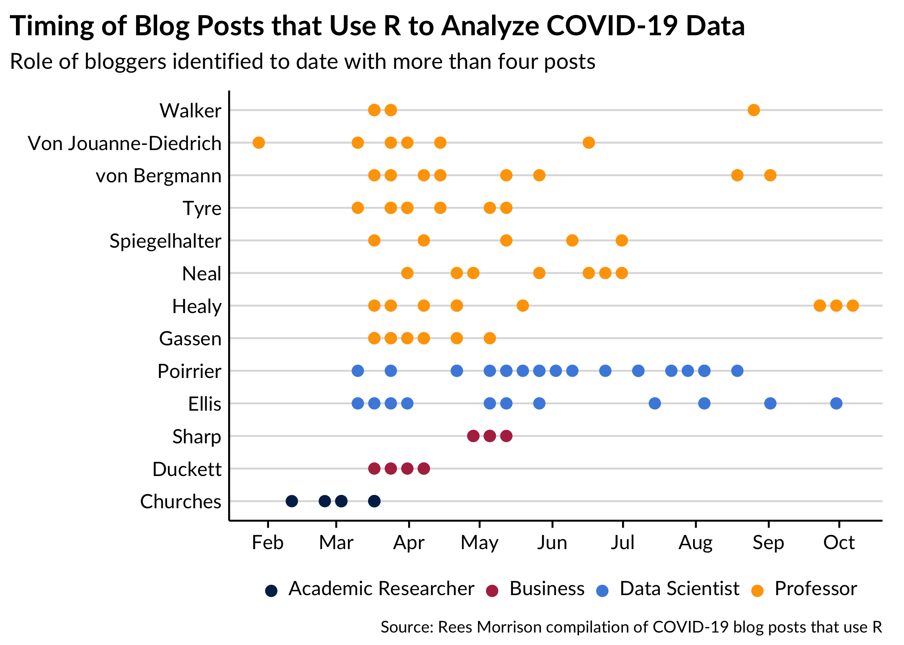
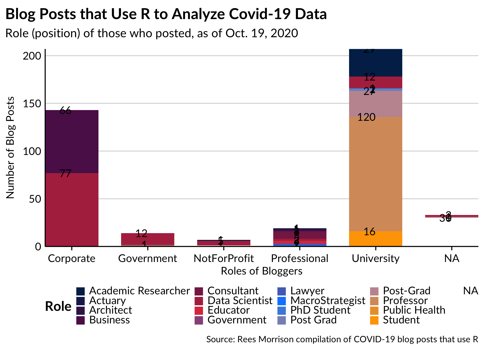
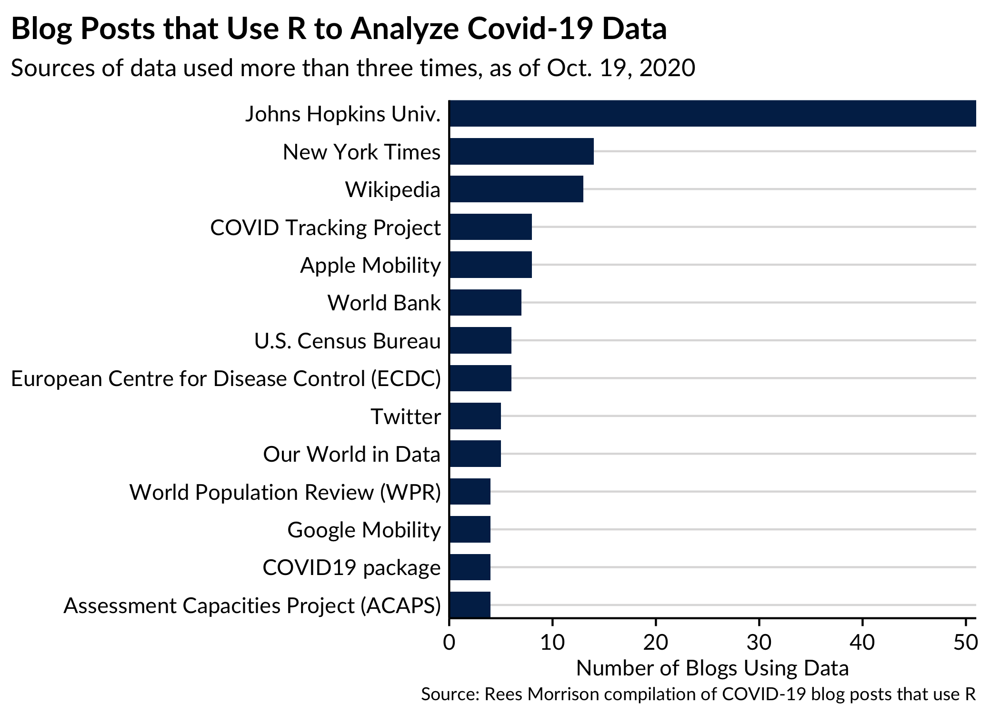
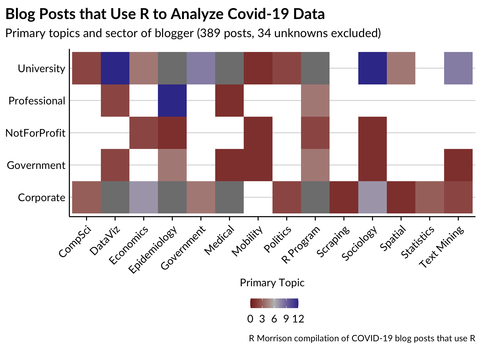

A Shiny App for 400+ Blog Posts on COVID-19 with R
================
Rees Morrison and Conor Rothschild
October 28, 2020

Our goal here is to help bloggers who want to analyze COVID-19 data by
unleashing R and the resources of its community by being able to
researching such posts (here, called "covidRposts).

Having so far found 423 covidRposts in English, we have published a
Shiny app for them. It lets users find the names of the 231 bloggers who
wrote those covidRposts, their roles, and country. The app also lets
users interactively search the collection of posts by primary topic,
title, date, and whether the post used a particular mathematical
technique and which source of data. To learn more about the evolution of
this data set, one of the authors has published nine articles on Medium.
The most recent Medium article links to the series
<https://medium.com/@rees_32356/my-previous-nine-articles-have-each-focused-on-a-different-finding-from-an-ever-growing-set-of-e774fb608dbd>

If anyone has corrections to the data set or knows other blog posts that
ought to be included in it, please write Rees (at) ReesMorrison (dot)
com. The data set analyzed in this post is available on GitHub \[ \].

The remainder of this post highlights some of the findings from the data
set of COVID-19posts. The first plot displays the pace of blog postings.
It shows the week of the year on the x-axis, starting in early-February,
and the number of posts on the y-axis. As the pandemic has ground on and
on, fewer bloggers have seized upon the data it has generated.

<!-- -->

Some bloggers have been prolific; many more have been one and done. For
the 23 bloggers who have published at least four covidRposts, the plot
below shows their names and their posts by week of 2020. For an example
of how to read the plot, Tim Churches, at the bottom of the reverse
alphabetical y-axis, has published a total of six posts, but none after
early April. Note that the text boxes with the months are somewhat
approximately located on the plot.

The color of the points corresponds to the work role of the blogger as
explained in the legend at the bottom. It is immediately apparent that
professors (blue) and academic researchers (red) predominate in this
group of bloggers. If you include the postgraduate students,
universities writ large account for nearly all of the prolific bloggers.

<!-- -->

We should explain “Role” a bit more. Bloggers, other than professors,
describe their work-day roles in a variety of ways. One of the authors
(Rees) standardized the multitude of terms and descriptions, but it is
quite possible that this effort misrepresented what some of these
bloggers do for a living. We welcome corrections.

Going further, the next plot assigned the bloggers into the broader role
categories. Those broader categories are represented as columns in the
following chart, with the segments showing the more granular roles. The
labels indicate the number of posts in the data set for each role within
a role category.

<!-- -->

The more data sources the R community knows for purposes of exploring
the coronavirus pandemic, the richer will be the insights. Data mashups
can shed new light on an issue; inconsistencies between data sets can
yield improvements; or better indices can be constructed. For that
reason, one of the authors (Rees) extracted from the collection of blog
posts information about their data sources.

For the most part, the bloggers identified the data source they drew on
for their analysis. However, standardizing that range of nearly 140 data
sources was a challenge

One takeaway can’t help but notice the absence of the U.S. CDC agency.
The other takeaway commends the dominance of Johns Hopkins, who early,
comprehensively and consistently has set the standard for COVID-19 data
collection and dissemination to the public.

<!-- --><!-- -->

Bloggers and other analysts would like a thumbnail summary of blogs.
Assigning each blog post a primary topic introduces a fair amount of
subjectivity, to be sure, but the hope is that these broad topics will
help researchers find content and colleagues who share similar
interests. Here, a heat map shows nine categories that the 160+ blogs
address as their primary topic. Epidemiology leads the way, as might be
expected, but also quite a few posts seem to take the Covid data as an
opportunity to show off a capability of the R programming language
(“DataViz”, “R Program” and “Statistics”).

<!-- -->
